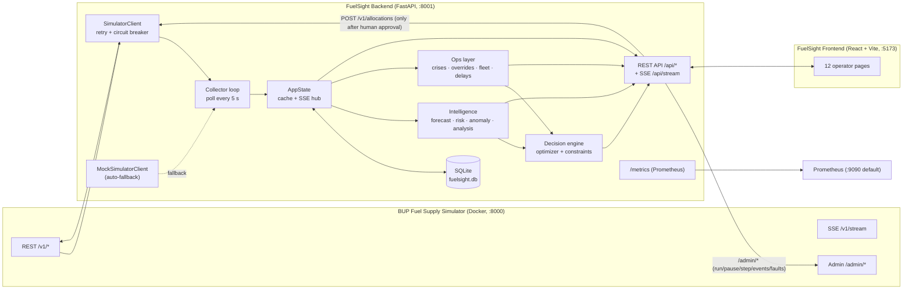

[FuelSight_ARCHITECTURE.md](https://github.com/user-attachments/files/32792420/FuelSight_ARCHITECTURE.md)
# FuelSight (FuelAI repo) — Full Project Architecture

> Generated from the actual contents of `github.com/shoraimw/FuelAI` (branch `main`):
> the FuelSight v2.2 source code (inside `FuelSight_v2.2_Features.zip`), the
> *BUP Fuel Supply Simulator Integration Guide* (PDF), and the *BUP CSE FEST 2026 Hackathon Finals*
> challenge brief (scanned PDF, read via OCR).
>
> Items marked **(recommended, not in repo)** are suggestions I added. Everything else comes from the code.

---

## 1. What this project is

**FuelSight** is an *operator-facing fuel supply decision-support platform* built for the
**BUP CSE FEST 2026 Hackathon Finals**. It sits on top of the organizer-provided
**BUP Fuel Supply Simulator** (a deterministic Bangladeshi fuel supply-chain world) and does this loop:

```
Observe → Detect → Predict → Decide → Simulate → Act → Monitor → Recover
```

Key idea: **human-in-the-loop**. The system *recommends* refill allocations; an operator *approves or rejects*;
only approved allocations are sent to the simulator (`POST /v1/allocations`). UI footer says:
*"Decision support, not autopilot"*.

The simulator is **never modified**. All operator data (vehicles, crises, overrides, delays) lives in FuelSight's own SQLite DB.

---

## 2. Repository layout (as it is on GitHub)

```
FuelAI/                                   ← GitHub repo root
├── BUP_Fuel_Supply_Simulator_Integration_Guide_Final.pdf        (16 pages, simulator API guide)
├── BUP_Fuel_Supply_Simulator_Integration_Guide_Final (1).pdf    (near-duplicate copy)
├── CamScanner 29-9-26 09.39.pdf                                 (10-page scanned challenge brief)
└── FuelSight_v2.2_Features.zip                                  ← the actual project source (zipped)
```

> ⚠️ The source code is **zipped** inside the repo, so GitHub does not show it as a browsable tree.
> Extract it first: `unzip FuelSight_v2.2_Features.zip`.

---

## 3. Full project structure (inside the zip)

```
FuelSight/
├── .env.example                      # environment template (copy to .env at repo root)
├── README.md                         # currently EMPTY (0 bytes)
│
├── .github/
│   └── workflows/
│       └── ci.yml                    # GitHub Actions: backend pytest + frontend build
│
├── backend/                          # FastAPI service  → port 8001
│   ├── requirements.txt
│   ├── pytest.ini                    # pythonpath = .
│   ├── app/
│   │   ├── main.py                   # app factory, CORS, metrics middleware, router wiring, /metrics mount
│   │   ├── state.py                  # AppState: collector loop, cache, SSE hub, "effective" views
│   │   ├── core/
│   │   │   └── config.py             # pydantic-settings (reads ROOT/.env)
│   │   ├── simulator/
│   │   │   ├── client.py             # httpx client + retry + circuit breaker
│   │   │   └── mock.py               # built-in mock simulator (same API shape)
│   │   ├── db/
│   │   │   └── store.py              # SQLite: snapshots, demand, alerts, recs, decisions, analyses, audit
│   │   ├── ops/
│   │   │   ├── store.py              # SQLite: vehicles, route constraints, delays, crises, overrides, meta
│   │   │   └── effects.py            # pure functions: apply crises/overrides on top of sim data
│   │   ├── intelligence/
│   │   │   ├── forecast.py           # per-station hourly forecast (HOD baseline + exp. smoothing)
│   │   │   ├── forecast_model.py     # ensemble model for manual analysis (EMA + window + trend)
│   │   │   ├── risk.py               # hours-to-stockout → LOW/MEDIUM/HIGH/CRITICAL
│   │   │   ├── anomaly.py            # z-score demand anomaly detection
│   │   │   └── analysis.py           # manual what-if storage trajectory analysis
│   │   ├── decision/
│   │   │   ├── constraints.py        # validate_candidate(): pre-check of an allocation
│   │   │   └── optimizer.py          # generate_recommendations(): heuristic allocation engine
│   │   ├── observability/
│   │   │   ├── metrics.py            # Prometheus counters/histograms/gauges
│   │   │   └── logging.py            # structured log format
│   │   └── api/                      # FastAPI routers
│   │       ├── state.py   intelligence.py   decisions.py   simulator_ctl.py
│   │       ├── health.py  stream.py         analysis.py    inventory.py
│   │       └── regions.py transport.py      supply.py      crisis.py
│   └── tests/
│       ├── conftest.py               # forces MOCK_MODE=true + temp DB, TestClient fixture
│       ├── test_constraints.py
│       ├── test_intelligence.py
│       └── test_ops_api.py           # 11 API tests (see §12)
│
├── frontend/                         # React + Vite SPA → port 5173
│   ├── index.html
│   ├── package.json  package-lock.json
│   ├── vite.config.ts                # dev server :5173 + proxy → :8001  (also stray vite.config.js / .d.ts)
│   ├── tsconfig.json  tsconfig.app.json  tsconfig.node.json
│   └── src/
│       ├── main.tsx                  # React root + BrowserRouter
│       ├── App.tsx                   # shell + 12 routes, polls /api/state/overview every 5 s
│       ├── styles.css
│       ├── lib/
│       │   ├── api.ts                # fetch wrapper: api/post/put/del
│       │   └── hooks.ts              # useApi (polling GET), useAction (mutation + toast)
│       ├── components/
│       │   ├── Sidebar.tsx  Topbar.tsx  MetricCard.tsx  RiskBadge.tsx  Notice.tsx
│       └── pages/
│           ├── Dashboard.tsx   Analysis.tsx   Inventory.tsx   Regions.tsx
│           ├── Transport.tsx   Supply.tsx     Crisis.tsx      Alerts.tsx
│           ├── Recommendations.tsx  Decisions.tsx  Scenarios.tsx  System.tsx
│
├── monitoring/
│   └── prometheus.yml                # scrapes 127.0.0.1:8001/metrics every 5 s
│
└── loadtest/
    └── k6_decision_api.js            # k6: 10 VUs, 30 s, GET /api/state/overview
```

Not present in the repo: `Dockerfile`, `docker-compose.yml`, Grafana config, Kubernetes/Helm files. See §14.

---

## 4. System architecture



### Layered view

| Layer | Folder | Responsibility |
|---|---|---|
| Presentation | `frontend/src` | Operator UI, polling + SSE refresh |
| API | `backend/app/api` | HTTP routing, request validation (Pydantic) |
| State / orchestration | `backend/app/state.py` | Cache, collector, SSE broadcast, effective views |
| Integration | `backend/app/simulator` | Simulator client, circuit breaker, mock |
| Intelligence | `backend/app/intelligence` | Forecast, risk, anomaly, what-if analysis |
| Decision | `backend/app/decision` | Recommendations + constraint pre-checks |
| Operator data | `backend/app/ops` | Crises, overrides, fleet, delays |
| Persistence | `backend/app/db`, `backend/app/ops/store.py` | SQLite |
| Observability | `backend/app/observability`, `monitoring/` | Prometheus metrics, logging |

---

## 5. Ports & URLs (everything in one table)

| Component | Port | URL | Source |
|---|---|---|---|
| **BUP Simulator** (Docker) | **8000** | `http://localhost:8000` | Simulator guide `docker-compose` (`8000:8000`) |
| Simulator Swagger UI | 8000 | `http://localhost:8000/docs` | Guide §3 |
| Simulator ReDoc | 8000 | `http://localhost:8000/redoc` | Guide §3 |
| Simulator admin dashboard | 8000 | `http://localhost:8000/admin` | Guide §3 |
| **FuelSight Backend** (FastAPI/uvicorn) | **8001** | `http://127.0.0.1:8001` | `config.py`, `.env.example` |
| Backend Swagger UI | 8001 | `http://127.0.0.1:8001/docs` | FastAPI default |
| Backend OpenAPI JSON | 8001 | `http://127.0.0.1:8001/openapi.json` | FastAPI default |
| Backend Prometheus metrics | 8001 | `http://127.0.0.1:8001/metrics` | `main.py` |
| **FuelSight Frontend** (Vite dev) | **5173** | `http://127.0.0.1:5173` | `vite.config.ts` |
| Prometheus server *(if you run it)* | 9090 *(default)* | `http://localhost:9090` | Port is Prometheus' default; repo only holds `prometheus.yml` |
| Grafana *(optional)* | 3000 *(default)* | — | **(recommended, not in repo)** |

**Dev proxy (frontend → backend):** Vite forwards `/api`, `/metrics`, `/docs`, `/openapi.json` to `http://127.0.0.1:8001`.
**CORS allow-list:** `http://localhost:5173`, `http://127.0.0.1:5173` (plus regex for any `localhost`/`127.0.0.1` port).

---

## 6. Configuration (`.env`)

The backend reads `.env` from the **repo root** (the folder that contains `backend/` and `frontend/`),
no matter where you start uvicorn from.

| Variable | Default | Meaning |
|---|---|---|
| `APP_NAME` | `FuelSight` | App name |
| `APP_ENV` | `development` | Environment label |
| `BACKEND_HOST` | `127.0.0.1` | Setting exists in config; you still pass `--host/--port` to uvicorn yourself |
| `BACKEND_PORT` | `8001` | Same as above |
| `SIMULATOR_URL` | `http://127.0.0.1:8000` | Where the real simulator lives |
| `DB_PATH` | `./data/fuelsight.db` | SQLite file (relative paths resolve from repo root) |
| `POLL_SECONDS` | `5` | Collector polling interval |
| `DEMAND_HISTORY_LIMIT` | `200` | Rows of `/v1/demand-history` fetched per poll |
| `CORS_ORIGINS` | `http://localhost:5173,http://127.0.0.1:5173` | Comma-separated allowed origins |
| `MOCK_MODE` | `false` | `true` = always use built-in mock simulator |
| `AUTO_MOCK_FALLBACK` | `true` | If the real simulator is unreachable at startup, switch to mock automatically |
| `LOG_LEVEL` | `INFO` | Python logging level |

Optional frontend variable: `VITE_API_URL` (defaults to empty → same-origin, via the Vite proxy).

---

## 7. Tech stack & dependencies

**Backend** (`backend/requirements.txt`, Python 3.12 in CI)

| Package | Version |
|---|---|
| fastapi | 0.116.1 |
| uvicorn[standard] | 0.35.0 |
| httpx | 0.28.1 |
| pydantic-settings | 2.10.1 |
| prometheus-client | 0.22.1 |
| pytest | 8.4.1 |

**Frontend** (`frontend/package.json`, Node 20 in CI)

| Package | Version |
|---|---|
| react / react-dom | ^18.3.1 |
| react-router-dom | ^6.28.0 |
| recharts | ^2.13.3 |
| lucide-react | ^0.460.0 |
| vite | ^5.4.11 |
| @vitejs/plugin-react | ^4.3.4 |
| typescript | ^5.6.3 |

**Other:** SQLite (stdlib `sqlite3`), Prometheus, k6 (load test), GitHub Actions (CI).

---

## 8. How to run it locally

### 8.1 Start the simulator (Docker)

```yaml
# docker-compose.yml (from the official simulator guide)
services:
  simulator-api:
    image: asifmahmoud414/bup-fuel-supply-simulator:1.0.0
    environment:
      SIMULATION_SPEED: ${SIMULATION_SPEED:-8}        # ticks per wall-clock second
      TICK_MINUTES: ${TICK_MINUTES:-15}               # simulated minutes per tick
      SIMULATOR_START_MODE: ${SIMULATOR_START_MODE:-paused}   # paused | running
    ports:
      - "8000:8000"
```

```bash
docker compose up -d
curl -s http://localhost:8000/v1/health
```

### 8.2 Start the backend

```bash
cd FuelSight
cp .env.example .env                       # edit if needed
cd backend
python -m venv .venv && source .venv/bin/activate     # Windows: .venv\Scripts\activate
pip install -r requirements.txt
uvicorn app.main:app --host 127.0.0.1 --port 8001 --reload
```

Check: `http://127.0.0.1:8001/` → `{"name":"FuelSight","status":"running","docs":"/docs"}`

### 8.3 Start the frontend

```bash
cd FuelSight/frontend
npm install
npm run dev            # http://127.0.0.1:5173
```

Other scripts: `npm run build`, `npm run typecheck`, `npm run preview`.

### 8.4 No simulator? Use mock mode

```bash
# in .env
MOCK_MODE=true
```

Or leave `MOCK_MODE=false` + `AUTO_MOCK_FALLBACK=true` and the backend falls back to the mock
if `GET {SIMULATOR_URL}/v1/health` fails within 2.5 s at startup (mode becomes `mock-fallback`).

### 8.5 Run tests / CI checks locally

```bash
pytest backend/tests -q                    # from repo root (as CI does)
cd frontend && npm run build
```

### 8.6 Prometheus & load test

```bash
prometheus --config.file=monitoring/prometheus.yml     # scrapes 127.0.0.1:8001/metrics every 5s
k6 run loadtest/k6_decision_api.js
```

---

## 9. Backend deep-dive

### 9.1 Startup flow (`main.py`)

1. `setup_logging(LOG_LEVEL)`.
2. FastAPI `lifespan`: creates `AppState`, starts the **collector** as an `asyncio` task; cancels it on shutdown.
3. CORS middleware + HTTP middleware that records `fuelsight_requests_total` and `fuelsight_request_latency_seconds` per method/path.
4. Includes 12 routers; mounts Prometheus ASGI app at `/metrics`; `GET /` returns a status stub.

### 9.2 `AppState` (`state.py`) — the heart of the backend

| Member | What it does |
|---|---|
| `store` (`Store`) | Snapshots, demand history, alerts, recommendations, decisions, analyses, audit |
| `ops` (`OpsStore`) | Vehicles, route constraints, supply delays, crises, status/region overrides, meta flags |
| `sim` | `SimulatorClient` (real) or `MockSimulatorClient` |
| `mode` | `simulator` \| `mock` \| `mock-fallback` |
| `cache` | Latest snapshot of each simulator resource |
| `sse_clients` | Set of `asyncio.Queue(maxsize=200)` — one per browser SSE connection |
| `probe_simulator()` | Startup health probe → auto-fallback to mock |
| `collector()` | Loop: (mock only: step if RUNNING) → `refresh()` → `seed_vehicles()` → sleep `POLL_SECONDS` |
| `refresh()` | GETs `instance, regions, depots, stations, routes, supply-arrivals, events, allocations, metrics` + `demand-history`; saves each to SQLite; updates Prometheus gauges; broadcasts `{"type":"refresh","tick":…}` |
| `broadcast()` | Pushes JSON to all SSE queues; drops clients whose queue is full |
| `snapshot(key)` | Serve from memory, else from SQLite (survives restart / simulator outage) |

**"Effective" views** — the simulator data with operator + crisis effects layered on top:

| Method | Applies |
|---|---|
| `stations_eff()` | Region override × crisis region multiplier × crisis station multiplier on `demand_multiplier`; status from operator override; `CLOSED` from crisis. Tracks `status_source` = `simulator` \| `operator` \| `crisis` |
| `depots_eff()` | Operator status override, crisis `DEPOT_OUTAGE` → `CLOSED` |
| `routes_eff()` | Blocks from simulator status, active crisis, or operator constraint; caps `max_shipment`; adds `extra_delay_ticks`; lists `block_reasons` |
| `arrivals_eff()` | Adds operator delays + crisis `SUPPLY_DELAY` → `delayed`, `delay_ticks`, `effective_tick` |
| `risk_table()` | Runs forecast + risk for every station × fuel using the effective (adjusted) demand |
| `fleet_errors(a)` | `NO_VEHICLE_AVAILABLE` if the depot has registered vehicles but none can carry the fuel |
| `seed_vehicles()` | Once: 2 default 10,000 L tankers per depot (id like `veh-gazipur-1`) |

Fuels handled everywhere: `DIESEL`, `PETROL`, `OCTANE`.

### 9.3 Simulator integration (`simulator/client.py`)

| Mechanism | Value |
|---|---|
| Request timeout | 4.0 s |
| Retries | 3 attempts, exponential backoff starting at 0.4 s (×2) |
| Retry on | `httpx.RequestError`, HTTP 502 / 503 / 504 |
| **Circuit breaker** | opens after **3** failures; `OPEN` for **10 s**, then `HALF_OPEN`; raises `SIMULATOR_CIRCUIT_OPEN` |
| Stale detection | Reads response header `X-Simulator-Stale: true` → `sim.stale` |
| Health fields | `last_ok`, `last_error`, `cb.state` |
| `sse()` | Streaming reader for `/v1/stream` is implemented in the client (the collector itself uses polling) |

### 9.4 Mock simulator (`simulator/mock.py`)

Same world as the real simulator: 2 regions, 2 depots, 4 stations, 6 routes, 3 fuels, 15-min ticks, seeded with
32 ticks (~8 h) of history so forecasts work instantly. Supports `/admin/run|pause|toggle|step|reset|events|faults`
and `POST /v1/allocations` with the same 409 error codes and idempotency behaviour.

### 9.5 Intelligence layer

**A. Station forecast (`forecast.py`)** — used for risk, recommendations, regional demand
- Base daily demand per `demand_profile` × fuel (`urban_high`, `industrial`, `highway`, `regional`).
- Hour-of-day factors (e.g. industrial 1.55 daytime / 0.45 night; urban_high 1.45 peaks / 0.70 off-peak).
- Exponential smoothing (α = 0.35) over the last 48 observations blended with the profile baseline
  (`0.6·level + 0.4·observed`), then × HOD factor × `demand_multiplier`.
- Output: `hourly_liters[24]`, `daily_estimate_liters`, `confidence = min(0.95, 0.55 + 0.01·n)`,
  `model = "HOD baseline + exponential smoothing"`.

**B. Risk classification (`risk.py`)**

`hours_to_stockout = inventory / (mean of next 4 forecast hours)`

| Hours to stockout | Risk |
|---|---|
| < 6 | **CRITICAL** |
| < 12 | **HIGH** |
| < 24 | **MEDIUM** |
| ≥ 24 | LOW |

**C. Anomaly detection (`anomaly.py`)** — z-score of newest tick vs previous 24 ticks
(σ floored at 15 % of mean); `|z| > 3` → anomaly ("Demand spike suspected" / "Demand drop suspected").
Needs ≥ 8 observations. Triggers a `HIGH` alert `anomaly:{station}:{fuel}` from `GET /api/risk`.

**D. Manual what-if analysis (`analysis.py` + `forecast_model.py`)**
`DemandForecastModel` = EMA (α 0.35) + recent-window average + linear trend (weight 0.25).
Takes operator-supplied demand points, current storage, capacity, incoming supply (+ arrival hour),
growth %, demand multiplier, safety stock % (default 25) and horizon (1–168 h). Returns forecast, projected storage curve,
stockout hour, safety-threshold hour, risk, recommended refill litres, confidence, plain-language `explanation[]`, and chart data.
Results are stored in the `analyses` table.

### 9.6 Decision engine

**`constraints.py → validate_candidate(candidate, depots, stations, routes)`** returns error codes:

`NOT_FOUND`, `ROUTE_MISMATCH`, `DEPOT_CLOSED`, `STATION_CLOSED`, `ROUTE_DISRUPTED`,
`ROUTE_CAPACITY_EXCEEDED`, `INSUFFICIENT_INVENTORY`, `DESTINATION_CAPACITY_EXCEEDED`
(mirrors the simulator's own validation, so problems are caught *before* the simulator says 409).

**`optimizer.py → generate_recommendations(...)`** — heuristic, explainable:
1. Sort risks by severity, then by hours-to-stockout; skip `LOW`.
2. For each risky station-fuel, try every `AVAILABLE` route into that station.
3. Quantity = `min(route max_shipment, depot inventory, depot dispatch capacity, free station capacity, target)`
   where `target = max(1000, 0.8 × current station inventory)`.
4. Validate with `validate_candidate`; drop failures.
5. Score candidates by `(hours_to_stockout < 12, −transit_ticks, quantity)` and keep the best.
6. Emit a recommendation with `title`, `allocation`, `risk_before`, `projected_hours_after`,
   `risk_reduction_percent`, `confidence`, `why[]`, `constraints.checks[]`, `alternatives[]`.

**Approval flow (`api/decisions.py`)**

```
POST /api/recommendations/generate      → stores "pending" recs, each with an idempotency_key (fs-<uuid>)
POST /api/recommendations/{id}/approve  → refresh state → validate_candidate + fleet_errors
                                          → POST /v1/allocations to simulator
                                          → status approved | decision logged (APPROVED / FAILED / REJECTED)
POST /api/recommendations/{id}/reject   → status rejected + decision logged
GET  /api/decisions                     → decision audit history
```

Pre-check failure → `409 {"code":"PRECHECK_FAILED","errors":[…]}`; simulator down → `503 SIMULATOR_UNAVAILABLE`.

### 9.7 Crisis model (`ops/effects.py`)

Crisis types: `DEMAND_SPIKE`, `ROUTE_DISRUPTION`, `DEPOT_OUTAGE`, `STATION_CLOSURE`, `SUPPLY_DELAY`, `FUEL_SHORTAGE`, `OTHER`.
Severity: `LOW`, `MEDIUM`, `HIGH`, `CRITICAL`.
Crisis state is computed against the simulator tick: `SCHEDULED` → `ACTIVE` → `EXPIRED`, or `RESOLVED` manually.

Network **crisis level** = worst of active crisis severities and live stockout risk:
`NORMAL → WATCH → ELEVATED → SEVERE → CRITICAL`
(≥ 3 CRITICAL risks ⇒ CRITICAL; ≥ 1 CRITICAL ⇒ SEVERE; ≥ 1 HIGH ⇒ ELEVATED).

`forward_to_simulator: true` on create forwards **only** `DEMAND_SPIKE` and `ROUTE_DISRUPTION` to `/admin/events`
(forwarded ones are not applied twice locally). Other types apply inside FuelSight only. `HIGH`/`CRITICAL` crises also raise an alert.

---

## 10. REST API reference (FuelSight backend, base `http://127.0.0.1:8001`)

### Core state
| Method | Path | Purpose |
|---|---|---|
| GET | `/` | Status stub |
| GET | `/api/state/overview` | Everything from the cache: instance, regions, depots, stations, routes, arrivals, events, allocations, metrics, `mode`, `stale`, `circuit_breaker`, `last_simulator_ok` |
| GET | `/api/stations/{id}` · `/api/depots/{id}` | Single raw entity |
| GET | `/api/routes` · `/api/supply-arrivals` | Raw simulator data |
| GET | `/api/health` | Component health (see §11) |
| GET | `/api/stream` | **SSE** — events `connected`, `update` (+ `: keepalive` every 15 s) |
| GET | `/metrics` | Prometheus exposition |

### Intelligence & alerts
| Method | Path | Purpose |
|---|---|---|
| GET | `/api/forecast/{station_id}/{fuel}?horizon=24` | Hourly forecast |
| GET | `/api/risk` | Risk row for every station × fuel (also raises anomaly alerts) |
| GET | `/api/alerts?status=` | List alerts |
| POST | `/api/alerts/{id}/ack` | Acknowledge alert |

### Analysis (manual what-if)
| Method | Path | Purpose |
|---|---|---|
| POST | `/api/analysis/manual` | Run analysis (requires `location`, `storage_capacity_liters > 0`) |
| GET | `/api/analysis/history?limit=50` | Saved analyses |
| GET | `/api/analysis/model` | Model description |

### Decisions
| Method | Path | Purpose |
|---|---|---|
| POST | `/api/recommendations/generate` | Build new pending recommendations |
| GET | `/api/recommendations?status=` | List |
| GET | `/api/recommendations/{id}` | One |
| POST | `/api/recommendations/{id}/approve` | Approve → sends to simulator |
| POST | `/api/recommendations/{id}/reject` | Reject |
| GET | `/api/decisions` | Decision history |

### Inventory & status
| Method | Path | Purpose |
|---|---|---|
| GET | `/api/inventory/stations` · `/api/inventory/depots` · `/api/inventory/summary` | Inventory views |
| GET | `/api/stations` · `/api/depots` | Effective lists |
| POST / DELETE | `/api/stations/{id}/status` | Set / clear operator status override (`OPEN`, `CLOSED`) |
| POST / DELETE | `/api/depots/{id}/status` | Set / clear (`OPEN`, `CONSTRAINED`, `CLOSED`) |

### Regional demand
| Method | Path | Purpose |
|---|---|---|
| GET | `/api/regions/demand` · `/api/regions/{region_id}/demand` | Forecast/observed demand, risk counts, cover hours |
| POST / DELETE | `/api/regions/{region_id}/demand-override` | Multiplier 0.1 < x ≤ 5.0 |

### Transport & routes
| Method | Path | Purpose |
|---|---|---|
| GET / POST | `/api/transport/vehicles` | List / create vehicle |
| GET / PUT / DELETE | `/api/transport/vehicles/{id}` | Read / update / delete |
| POST | `/api/transport/vehicles/{id}/status` | `AVAILABLE`, `IN_TRANSIT`, `MAINTENANCE`, `OFFLINE` |
| GET | `/api/transport/routes` · `/api/transport/routes/{id}` | Effective route view |
| PUT / DELETE | `/api/transport/routes/{id}/constraints` | Block / cap load / add delay ticks |
| POST | `/api/transport/plan` | **Dry-run** shipment planner (feasibility, ETA, trips, station fill after delivery) — nothing is sent to the simulator |

### Supply & delays
| Method | Path | Purpose |
|---|---|---|
| GET | `/api/supply/arrivals?delayed=&depot_id=` | Arrivals with delay summary |
| GET / POST | `/api/supply/delays` | List / add operator delay |
| POST | `/api/supply/delays/{id}/resolve` | Resolve |
| DELETE | `/api/supply/delays/{id}` | Delete |

### Crisis conditions
| Method | Path | Purpose |
|---|---|---|
| GET | `/api/crises?status=` | List (`ACTIVE`/`SCHEDULED`/`EXPIRED`/`RESOLVED`) |
| GET | `/api/crises/level` | Network crisis level + top risks |
| POST | `/api/crises` | Create (`forward_to_simulator` optional) |
| GET | `/api/crises/{id}` | One |
| POST | `/api/crises/{id}/resolve` | Resolve |
| DELETE | `/api/crises/{id}` | Delete |

### Simulator control (proxy to `/admin/*`)
| Method | Path | Simulator call |
|---|---|---|
| POST | `/api/sim/run` · `/pause` · `/toggle` · `/step` · `/reset` | `/admin/run` … `/admin/reset` |
| POST | `/api/sim/events` | `/admin/events` |
| POST | `/api/sim/faults` · `/api/sim/faults/clear` | `/admin/faults` … |

---

## 11. Data model (SQLite, one file: `data/fuelsight.db`)

Two classes (`Store`, `OpsStore`) share the same DB file.

**`Store` tables**

| Table | Key columns |
|---|---|
| `snapshots` | `key` (PK), `payload` JSON, `updated_at` |
| `demand_history` | PK (`station_id`, `fuel_type`, `tick`), `sim_time`, `demand_liters`, `served_liters`, `unmet_liters` |
| `alerts` | `alert_key` UNIQUE, `severity`, `title`, `message`, `station_id`, `fuel_type`, `status` (`active`/`acknowledged`) |
| `recommendations` | `payload` JSON, `status` (`pending`/`approved`/`rejected`) |
| `decisions` | `recommendation_id`, `action`, `operator`, `reason`, `simulator_response` |
| `analyses` | `payload` JSON, `created_at` |
| `audit` | `action`, `entity_type`, `entity_id`, `payload` |

**`OpsStore` tables**

| Table | Key columns |
|---|---|
| `vehicles` | `id` PK, `name`, `vehicle_type`, `capacity_liters`, `fuel_types` JSON, `depot_id`, `status`, `driver`, `notes` |
| `route_constraints` | `route_id` PK, `blocked`, `max_load_liters`, `extra_delay_ticks`, `reason` |
| `supply_delays` | `arrival_id`, `depot_id`, `fuel_type`, `delay_ticks`, `reason`, `status` (`ACTIVE`/`RESOLVED`) |
| `crises` | `type`, `severity`, `title`, `region_id`, `station_ids`, `route_ids`, `depot_ids`, `fuel_type`, `demand_multiplier`, `delay_ticks`, `start_tick`, `duration_ticks`, `status`, `forwarded`, `sim_response` |
| `status_overrides` | PK (`kind`, `id`), `status`, `reason` |
| `region_overrides` | `region_id` PK, `multiplier`, `note` |
| `meta` | `key` PK, `value` (e.g. `vehicles_seeded`) |

---

## 12. Frontend deep-dive

**Shell:** `App.tsx` renders `Sidebar` + `Topbar` and 12 routes; it polls `/api/state/overview` every 5 s to show sim tick, stale flag and mode.
Dashboard also opens an `EventSource('/api/stream')` and reloads on each `update` event.
Helpers: `useApi(path, ms)` polls a GET; `useAction(after)` runs a mutation and shows an OK/error notice.

| Route | Page | Purpose |
|---|---|---|
| `/` | Dashboard | KPIs, risks, simulator run/pause controls |
| `/analysis` | Analysis & Forecast | Manual what-if forecast + storage chart |
| `/inventory` | Inventory & Status | Station/depot stock, open/closed overrides |
| `/regions` | Regional Demand | Regional forecast, demand overrides |
| `/transport` | Transport & Routes | Fleet CRUD, route constraints, shipment planner |
| `/supply` | Supply & Delays | Arrivals, operator delays |
| `/crisis` | Crisis Conditions | Create/resolve crises, network crisis level |
| `/alerts` | Alerts | Alert list + acknowledge |
| `/recommendations` | Recommendations | Generate / approve / reject |
| `/decisions` | Decisions | Audit trail |
| `/scenarios` | Scenarios | Inject simulator events/faults |
| `/system` | System Status | Health of backend, DB, simulator, breaker |

Shared components: `Sidebar`, `Topbar`, `MetricCard`, `RiskBadge`, `Notice`. Charts use **Recharts**, icons **lucide-react**.
Sidebar tag: *"BUP Simulator + Manual Mode"*.

---

## 13. Observability, resilience, health

**Prometheus metrics** (`/metrics`)

| Metric | Type | Meaning |
|---|---|---|
| `fuelsight_requests_total{method,path,status}` | Counter | API request count |
| `fuelsight_request_latency_seconds{method,path}` | Histogram | API latency |
| `fuelsight_fallback_activations_total` | Counter | Defined; not incremented anywhere yet |
| `fuelsight_prediction_confidence` | Gauge | Last forecast confidence |
| `fuelsight_service_level` | Gauge | Simulator service level |
| `fuelsight_simulator_up` | Gauge | 1 if last simulator call succeeded |
| `fuelsight_simulator_stale` | Gauge | 1 if stale-data header seen |

**`GET /api/health` response:** `backend`, `database`, `simulator` (`healthy`/`degraded`), `prediction_service`,
`decision_engine`, `degraded`, `circuit_breaker` (`CLOSED`/`OPEN`/`HALF_OPEN`), `stale`, `mode`.

**Resilience behaviours implemented**

| Failure | Behaviour |
|---|---|
| Simulator down at startup | Auto-switch to built-in mock (`AUTO_MOCK_FALLBACK`) |
| Simulator flapping / 5xx | Retry ×3 with backoff, then circuit breaker (3 fails → open 10 s) |
| Simulator unreachable later | Serve last snapshot from SQLite; `degraded: true` on `/api/health` |
| Stale data fault | Detected via `X-Simulator-Stale`; surfaced in overview + gauge |
| Invalid / infeasible allocation | Rejected by pre-check (`PRECHECK_FAILED`) with reasons; logged to `decisions` |
| Simulator rejects allocation | Decision logged as `FAILED`; HTTP error returned |
| Idempotency | Every recommendation carries an `idempotency_key` reused in the allocation → safe retries |

**Logging:** `time | LEVEL | logger | message`. **Audit:** crisis create/resolve etc. go to the `audit` table.

---

## 14. CI/CD, testing, load testing

**GitHub Actions (`.github/workflows/ci.yml`)** — on push and pull request:
- `backend`: Python 3.12 → `pip install -r backend/requirements.txt` → `pytest backend/tests -q`
- `frontend`: Node 20 → `npm install` → `npm run build`

**Tests (`backend/tests`)** run in mock mode with a temp DB:
`test_route_capacity` (constraints), `test_forecast_and_risk` (intelligence), and in `test_ops_api.py`:
inventory, station status override, regional demand, vehicles CRUD, route constraints & plan,
fleet blocks when no vehicle, supply delays, supply arrival shift, crisis lifecycle,
crisis route/station effects + forward, recommendation respects constraints.

**Load test (`loadtest/k6_decision_api.js`)** — 10 virtual users, 30 s, `GET /api/state/overview`,
thresholds: error rate < 5 %, p95 < 800 ms, p99 < 1500 ms.

---

## 15. Simulator reference (the external system FuelSight talks to)

**World:** 2 regions, 2 depots, 4 stations, 6 routes, 3 fuels (DIESEL/PETROL/OCTANE), tick = 15 simulated minutes,
deterministic (same seed + same actions ⇒ same state). One simulator instance per participant.

| Depots | Region | Dispatch/tick | Capacity D/P/O | Initial D/P/O |
|---|---|---|---|---|
| depot-gazipur | region-dhaka | 12,000 | 90k / 70k / 45k | 60k / 45k / 26k |
| depot-patiya | region-chattogram | 11,000 | 85k / 65k / 40k | 55k / 42k / 24k |

| Stations | Region | Profile | Capacity D/P/O |
|---|---|---|---|
| station-mirpur | dhaka | urban_high | 15k / 14k / 9k |
| station-tongi | dhaka | industrial | 18k / 9k / 6k |
| station-karnaphuli | chattogram | highway | 14k / 15k / 9k |
| station-coxsbazar | chattogram | regional | 12k / 12k / 7k |

| Route | Transit ticks | Max shipment |
|---|---|---|
| gazipur → mirpur | 2 | 7,000 |
| gazipur → tongi | 2 | 6,500 |
| patiya → karnaphuli | 2 | 7,000 |
| patiya → coxsbazar | 3 | 6,000 |
| gazipur → karnaphuli | 4 | 5,000 |
| patiya → mirpur | 4 | 5,000 |

**Simulator endpoints used**

| Kind | Endpoints |
|---|---|
| Read (REST) | `GET /v1/health, /v1/instance, /v1/regions, /v1/depots, /v1/stations, /v1/routes, /v1/supply-arrivals, /v1/events, /v1/allocations, /v1/demand-history?limit=, /v1/metrics` |
| Write (only one) | `POST /v1/allocations` (body: `idempotency_key, source_depot_id, destination_station_id, route_id, fuel_type, quantity`) |
| Cancel | `POST /v1/allocations/{id}/cancel` (PENDING only) |
| Push | `GET /v1/stream` (SSE: `simulation.tick`, `allocation.status_changed`, `inventory.updated`, `simulator.notice`) |
| Admin | `POST /admin/run, /pause, /toggle, /step, /reset, /events, /faults, /faults/clear`; `GET /admin/audit, /admin/faults, /admin/events` |

**Simulator event types** (`/admin/events`): `demand_spike`, `route_disruption`, `station_outage`, `depot_constraint`, `shipment_delay`, `supply_shortfall`.
**Fault types** (`/admin/faults`): `latency`, `unavailable`, `error_rate`, `stale_data`, `stream_disconnect`.

**Allocation error codes (HTTP 409):** `ROUTE_MISMATCH`, `DEPOT_CLOSED`, `STATION_CLOSED`, `ROUTE_DISRUPTED`,
`ROUTE_CAPACITY_EXCEEDED`, `INSUFFICIENT_INVENTORY`, `DISPATCH_CAPACITY_EXCEEDED`, `DESTINATION_CAPACITY_EXCEEDED`,
`IDEMPOTENCY_KEY_MISMATCH`, `CANNOT_CANCEL`. Also `404 NOT_FOUND`, `422` validation, `503 FAULT_INJECTED`.

---

## 16. Hackathon requirements → where FuelSight covers them

| Brief requirement | Status | Where |
|---|---|---|
| Operator-facing app | ✅ | `frontend/` (12 pages) |
| Backend + simulator integration | ✅ | `backend/app/simulator`, `state.py` |
| Intelligence (predict/detect/decide) | ✅ | forecast, risk, anomaly, optimizer |
| Explainable recommendations | ✅ | `why[]`, `constraints`, `risk_reduction_percent`, `confidence` |
| Crisis handling | ✅ | `ops/effects.py`, `/api/crises`, `/scenarios` page |
| Resilience | ✅ | retries, circuit breaker, cache, mock fallback |
| Observability | ✅ / partial | Prometheus metrics + `prometheus.yml`; **no Grafana dashboard** |
| Health & status page | ✅ | `/api/health`, `/system` |
| CI/CD | ✅ | GitHub Actions (test + build only) |
| Load testing | ✅ | k6 script (results not in repo) |
| **Reproducible deploy (`docker compose up`)** | ❌ **missing** | No Dockerfile/compose for FuelSight |
| Generative AI (optional) | ➖ not present | — |
| Reinforcement learning (optional) | ➖ not present | — |

---

## 17. Known gaps & things to fix (honest review)

1. **No containerization.** Brief §12 asks for `docker compose up`. Add Dockerfiles + compose (see §18).
2. **README.md is empty** — this document can replace it.
3. **Source is zipped** in the repo; commit the extracted `FuelSight/` folder so it's browsable and diffable.
4. **`.env` is not created for you** — copy `.env.example`; `BACKEND_HOST/PORT` aren't used by uvicorn unless you pass them.
5. **Duplicate Vite configs** (`vite.config.ts`, `vite.config.js`, `vite.config.d.ts`) — keep only the `.ts`.
6. **`DISPATCH_CAPACITY_EXCEEDED` is not pre-checked** in `validate_candidate` (optimizer respects dispatch capacity for sizing, but manual/planned shipments could still hit a simulator 409).
7. **Station status `OUTAGE`** (simulator) vs `CLOSED` (FuelSight override) — both block allocations because validation requires `OPEN`; keep in mind when reading statuses.
8. **`fuelsight_fallback_activations_total`** metric is defined but never incremented; simulator SSE (`client.sse()`) exists but the collector uses polling.
9. **No auth** on operator actions (approve/reject/sim control). Brief §18 suggests restricting sensitive actions.
10. **Load-test and observability evidence** (results, dashboards) aren't in the repo yet — brief §19 requires them.
11. Some source comments/messages are in Bangla-English (e.g. "Backend connect hocche na") — fine, but consider standardizing.

---

## 18. (Recommended, not in repo) Docker setup to satisfy the brief

`backend/Dockerfile`
```dockerfile
FROM python:3.12-slim
WORKDIR /app
COPY backend/requirements.txt .
RUN pip install --no-cache-dir -r requirements.txt
COPY backend/ .
ENV DB_PATH=/data/fuelsight.db
EXPOSE 8001
CMD ["uvicorn", "app.main:app", "--host", "0.0.0.0", "--port", "8001"]
```

`frontend/Dockerfile` (dev server; for production build with nginx instead)
```dockerfile
FROM node:20-alpine
WORKDIR /app
COPY frontend/package*.json ./
RUN npm ci
COPY frontend/ .
EXPOSE 5173
CMD ["npm", "run", "dev", "--", "--host", "0.0.0.0"]
```

`docker-compose.yml`
```yaml
services:
  simulator-api:
    image: asifmahmoud414/bup-fuel-supply-simulator:1.0.0
    environment:
      SIMULATION_SPEED: 8
      TICK_MINUTES: 15
      SIMULATOR_START_MODE: paused
    ports: ["8000:8000"]

  backend:
    build: { context: ., dockerfile: backend/Dockerfile }
    environment:
      SIMULATOR_URL: http://simulator-api:8000
      MOCK_MODE: "false"
      AUTO_MOCK_FALLBACK: "true"
      CORS_ORIGINS: http://localhost:5173,http://127.0.0.1:5173
      DB_PATH: /data/fuelsight.db
    volumes: ["fuelsight-data:/data"]
    ports: ["8001:8001"]
    depends_on: [simulator-api]

  frontend:
    build: { context: ., dockerfile: frontend/Dockerfile }
    ports: ["5173:5173"]
    depends_on: [backend]

  prometheus:
    image: prom/prometheus:latest
    volumes: ["./monitoring/prometheus.yml:/etc/prometheus/prometheus.yml:ro"]
    ports: ["9090:9090"]
    depends_on: [backend]

volumes:
  fuelsight-data:
```

> Note: inside Docker, the Vite proxy target (`127.0.0.1:8001`) and `monitoring/prometheus.yml` target must be changed to
> the service name `backend:8001`.

---

## 19. Quick command cheat-sheet

```bash
# Simulator
docker compose up -d && curl -s localhost:8000/v1/health

# Backend
cd backend && pip install -r requirements.txt && uvicorn app.main:app --host 127.0.0.1 --port 8001 --reload

# Frontend
cd frontend && npm install && npm run dev

# Tests
pytest backend/tests -q

# Load test
k6 run loadtest/k6_decision_api.js

# Useful URLs
#   UI            http://127.0.0.1:5173
#   API docs      http://127.0.0.1:8001/docs
#   Health        http://127.0.0.1:8001/api/health
#   Metrics       http://127.0.0.1:8001/metrics
#   Simulator     http://localhost:8000/docs   (admin: /admin)
```
